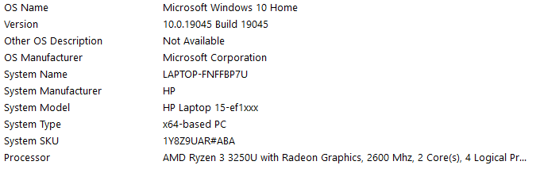
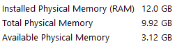
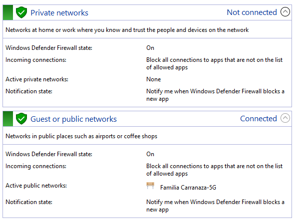
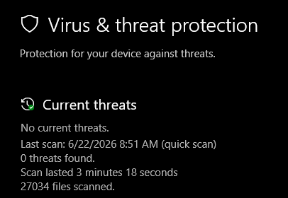

# Windows Security Hardening Assessment

## Introduction

This project demonstrates a Windows security hardening assessment focused on reviewing key security configurations and identifying security controls implemented within a Windows environment.

The objective of the assessment was to evaluate firewall settings, endpoint protection, password policies, account lockout settings, audit configurations, and local account security from a defensive cybersecurity perspective.

Security hardening assessments are commonly performed by cybersecurity professionals to reduce attack surfaces, improve system security, and verify compliance with organizational security standards.

The assessment was performed using native Windows security features and command-line tools to evaluate the overall security posture of the system.

## Lab Environment

* Windows 10
* Windows Defender Firewall
* Microsoft Defender
* Command Prompt
* Windows Security
* Audit Policy Tools

## Assessment Objectives

* Review firewall configuration
* Verify endpoint protection status
* Analyze password policies
* Review account lockout settings
* Evaluate audit policy configuration
* Identify local user accounts
* Review administrator privileges
* Assess overall system security posture

## 1. System Information Assessment

The assessment began by reviewing the system configuration and hardware information.

System information provides a baseline understanding of the operating system, hardware specifications, and architecture being evaluated during the security review.

The system was identified as a Windows 10 workstation running on a 64-bit architecture with an AMD Ryzen processor and 12 GB of installed memory.

Reviewing system information helps analysts understand the environment being assessed and provides context for security configuration reviews.

## 2. Windows Firewall Assessment

The Windows Defender Firewall configuration was reviewed as part of the security hardening assessment.

Firewalls are a critical security control because they help regulate network communications and reduce exposure to unauthorized access attempts.

The review focused on verifying that the firewall was enabled and actively protecting the system through its security profiles.

### Assessment Findings

The firewall profiles were reviewed using native Windows tools. The assessment confirmed that Windows Defender Firewall was enabled and actively protecting the system.

No disabled firewall profiles were identified during the review.

### Security Assessment

An enabled firewall helps prevent unauthorized inbound connections and reduces the attack surface exposed to external systems.

Maintaining active firewall protection is considered a fundamental security best practice for both enterprise and personal systems.

## 3. Microsoft Defender Assessment

The Microsoft Defender Antivirus configuration was reviewed to verify the status of the system's endpoint protection.

Endpoint protection solutions play a critical role in detecting, preventing, and responding to malicious software, suspicious activity, and security threats targeting Windows systems.

The review focused on confirming that Microsoft Defender was operational and actively protecting the device.

### Assessment Findings

The assessment confirmed that Microsoft Defender Antivirus was enabled and functioning correctly.

No active threats were identified at the time of the review, and the endpoint protection service was actively monitoring the system.

### Security Assessment

Maintaining active endpoint protection helps reduce the risk of malware infections, unauthorized software execution, and other security threats.

Microsoft Defender provides real-time protection, threat detection capabilities, and integration with Windows security features, making it an important component of the overall security posture.

