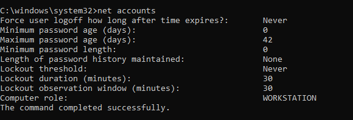
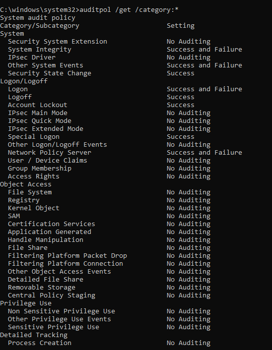
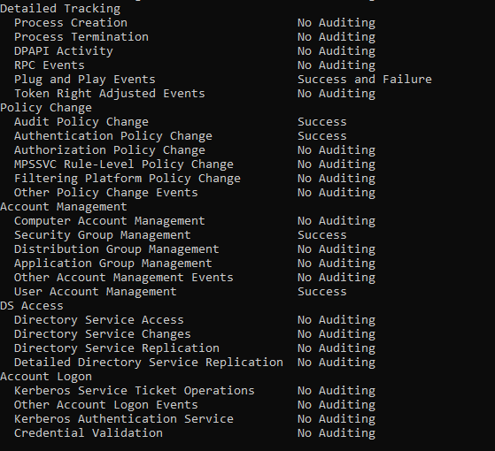
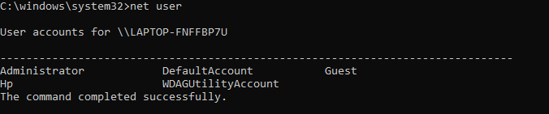
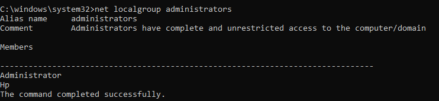

# Windows Security Hardening Assessment

## Introduction

This project demonstrates a Windows security hardening assessment focused on reviewing key security configurations and identifying security controls implemented within a Windows environment.

The objective of the assessment was to evaluate firewall settings, endpoint protection, password policies, account lockout settings, audit configurations, and local account security from a defensive cybersecurity perspective.

Security hardening assessments are commonly performed by cybersecurity professionals to reduce attack surfaces, improve system security, and verify compliance with organizational security standards.

The assessment was performed using native Windows security features and command-line tools to evaluate the overall security posture of the system.

## Lab Environment

* Windows 10
* Windows Defender Firewall
* Microsoft Defender
* Command Prompt
* Windows Security
* Audit Policy Tools

## Assessment Objectives

* Review firewall configuration
* Verify endpoint protection status
* Analyze password policies
* Review account lockout settings
* Evaluate audit policy configuration
* Identify local user accounts
* Review administrator privileges
* Assess overall system security posture

## 1. System Information Assessment

The assessment began by reviewing the system configuration and hardware information.

System information provides a baseline understanding of the operating system, hardware specifications, and architecture being evaluated during the security review.

The system was identified as a Windows 10 workstation running on a 64-bit architecture with an AMD Ryzen processor and 12 GB of installed memory.

Reviewing system information helps analysts understand the environment being assessed and provides context for security configuration reviews.

## 2. Windows Firewall Assessment

The Windows Defender Firewall configuration was reviewed as part of the security hardening assessment.

Firewalls are a critical security control because they help regulate network communications and reduce exposure to unauthorized access attempts.

The review focused on verifying that the firewall was enabled and actively protecting the system through its security profiles.

### Assessment Findings

The firewall profiles were reviewed using native Windows tools. The assessment confirmed that Windows Defender Firewall was enabled and actively protecting the system.

No disabled firewall profiles were identified during the review.

### Security Assessment

An enabled firewall helps prevent unauthorized inbound connections and reduces the attack surface exposed to external systems.

Maintaining active firewall protection is considered a fundamental security best practice for both enterprise and personal systems.

## 3. Microsoft Defender Assessment

The Microsoft Defender Antivirus configuration was reviewed to verify the status of the system's endpoint protection.

Endpoint protection solutions play a critical role in detecting, preventing, and responding to malicious software, suspicious activity, and security threats targeting Windows systems.

The review focused on confirming that Microsoft Defender was operational and actively protecting the device.

### Assessment Findings

The assessment confirmed that Microsoft Defender Antivirus was enabled and functioning correctly.

No active threats were identified at the time of the review, and the endpoint protection service was actively monitoring the system.

### Security Assessment

Maintaining active endpoint protection helps reduce the risk of malware infections, unauthorized software execution, and other security threats.

Microsoft Defender provides real-time protection, threat detection capabilities, and integration with Windows security features, making it an important component of the overall security posture.

## 4. Password Policy Assessment

The local password policy was reviewed using the Windows `net accounts` command.

Password policies are an important security control because they help protect user accounts against unauthorized access, credential guessing, and brute-force attacks.

The assessment focused on password age requirements, password history enforcement, minimum password length, and account lockout settings.

### Assessment Findings

The following password policy settings were identified:

* Maximum password age: 42 days
* Minimum password length: 0 characters
* Password history enforcement: Not configured
* Account lockout threshold: Disabled (Never)

### Security Assessment

The system enforced periodic password changes through a maximum password age of 42 days. However, several weaknesses were identified during the review.

The minimum password length requirement was configured as 0 characters, allowing weak passwords to be used. Additionally, password history enforcement was not configured, which may allow password reuse.

The most significant finding was that account lockout protection was disabled. Without an account lockout threshold, unlimited authentication attempts could be performed without triggering a temporary account lockout.

### Recommendations

* Configure a minimum password length of at least 12 characters.
* Enable password history enforcement.
* Configure an account lockout threshold to reduce brute-force attack risks.
* Review password complexity requirements through Local Security Policy.

## 5. Audit Policy Assessment

The Windows audit policy configuration was reviewed using the `auditpol` utility.

Audit policies determine which security-related activities are recorded within Windows event logs and provide critical visibility for security monitoring, incident response, and forensic investigations.

The assessment focused on identifying whether important security events were being logged by the operating system.

### Assessment Findings

The audit policy review showed that Windows was configured to record multiple security-related events across several categories, including:

* Logon and Logoff Events
* Account Management
* Policy Change Events
* Privilege Use
* System Events
* Object Access Activities

### Security Assessment

Audit logging provides visibility into user activity, authentication attempts, system changes, and security-related events occurring within the operating system.

Maintaining audit policies is essential for detecting suspicious activity, investigating incidents, and supporting forensic analysis.

The presence of active audit configurations improves monitoring capabilities and strengthens the overall security posture of the system.

## 6. Local Users Assessment

The local user accounts configured on the system were reviewed using the Windows `net user` command.

Reviewing local accounts is an important security practice because unused, unnecessary, or improperly managed accounts can increase the attack surface of a system.

The assessment focused on identifying existing local accounts and reviewing their purpose within the operating system.

### Assessment Findings

Several local user accounts were identified during the review, including default Windows accounts and user-created accounts.

The system contained standard built-in accounts used by Windows as well as the primary user account utilized during normal system operation.

### Security Assessment

Maintaining visibility into local user accounts helps security administrators identify unnecessary accounts, review account usage, and verify compliance with security policies.

Unused or unauthorized accounts should be disabled or removed to reduce potential security risks and minimize opportunities for unauthorized access.

Regular account reviews are considered a security best practice in both enterprise and personal environments.

## 7. Administrator Privileges Assessment

The local Administrators group was reviewed using the Windows `net localgroup administrators` command.

Administrative privileges provide elevated access to system resources and security settings. As a result, membership within the Administrators group should be carefully controlled and regularly reviewed.

### Assessment Findings

The assessment identified the accounts that currently possess local administrator privileges on the system.

These accounts have the ability to install software, modify security settings, manage user accounts, and perform other privileged administrative tasks.

### Security Assessment

Limiting administrative privileges helps reduce the impact of compromised accounts and supports the principle of least privilege.

Organizations commonly review administrator group membership to ensure that only authorized users retain elevated access.

Regular privilege reviews help strengthen system security and reduce opportunities for privilege misuse.

## Key Findings

During the assessment, several important security findings were identified:

* Windows Defender Firewall was enabled and actively protecting the system.
* Microsoft Defender Antivirus was operational and no active threats were detected.
* Password expiration was configured with a maximum age of 42 days.
* Minimum password length was configured as 0 characters.
* Password history enforcement was not configured.
* Account lockout protection was disabled.
* Audit policies were configured to record multiple security-related events.
* Local user accounts and administrator privileges were successfully reviewed.

The assessment identified both effective security controls and opportunities for improvement within the system's security configuration.

## Security Recommendations

Based on the assessment findings, the following recommendations were identified:

1. Configure a minimum password length of at least 12 characters.
2. Enable password history enforcement to prevent password reuse.
3. Configure an account lockout threshold to reduce brute-force attack risks.
4. Periodically review local user accounts and remove unused accounts.
5. Review administrator group membership on a regular basis.
6. Maintain Windows Defender and security updates in an active state.
7. Continue monitoring audit logs for security-related events.

Implementing these recommendations would further strengthen the overall security posture of the system.

## Skills Demonstrated

This project provided hands-on experience with:

* Windows Security Assessment
* Security Hardening Fundamentals
* Firewall Configuration Review
* Microsoft Defender Analysis
* Password Policy Assessment
* Audit Policy Review
* User Account Security
* Privilege Management
* Security Control Evaluation
* Cybersecurity Documentation

## Conclusion

This project demonstrated a Windows security hardening assessment using native Windows security tools and configuration reviews.

The assessment evaluated firewall protection, endpoint security, password policies, audit logging, local user accounts, and administrative privileges to determine the overall security posture of the system.

Several effective security controls were identified, including active firewall protection, operational endpoint security, and configured audit logging. The assessment also revealed opportunities for improvement related to password security and account lockout protection.

Through this project, practical experience was gained in system security assessment, security control evaluation, risk identification, and cybersecurity documentation.

The project highlights the importance of security hardening as a foundational component of defensive cybersecurity and system protection.

